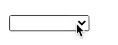

# About

Estudo sobre formulários do curso de React da Origamid.

# Input

Vamos abordar como criar um campo de formulário reativo.

## Reatividade

Precisamos definir o estado para o ``value`` (usando hook) e a função atualizadora (set que vem do hook) para o ``onChange``.

O valor que está sendo alterado fica dentro de event, então acessamos o target com seu valor.

```jsx
const App = () => {
    const [nome, setNome] = useState('');
    
    return (
        <form>
            <label htmlFor="nome">Nome</label>
            <input
                type="text"
                id="nome" //usa o mesmo que está no htmlFor
                value={nome}
                onChange={(event) => setNome(event.target.value)}
            />
            <p>{nome}</p>
        </form>
    )
}
```

## Form

No form controlamos o que acontece ao enviar o mesmo, por isso definimos uma função para lidar com o ``onSubmit``.

O ``preventDefault()`` irá prevenir o comportamento padrão, que seria de atualizar a página, enviando uma requisição
para o que estiver em ``action=""``.

Então não precisa colocar o evento de onSubmit no botão! Se o botão está dentro de form, o submit já será feito.

```jsx
const App = () => {
    const [nome, setNome] = useState('');
    
    function handleSubmit(event) {
        event.preventDefault(); //evita refresh da tela
        console.log(nome)
    }
    
    return (
        <form onSubmit={handleSubmit}>
            <label htmlFor="nome">Nome</label>
            <input
                type="text"
                id="nome" //usa o mesmo que está no htmlFor
                value={nome}
                onChange={(event) => setNome(event.target.value)}
            />
            <button>Enviar</button>
        </form>
    )
}
```

## Múltiplos Campos

Às vezes, vamos lidar com múltiplos campos no form, um para email, outro para nome, etc. Existe duas maneiras de lidar
com isso:

1. Podemos definir um estado (useState) para cada campo (nome, email, etc).

```jsx
const App = () => {
  const [nome, setNome] = React.useState('');
  const [email, setEmail] = React.useState('');

  function handleSubmit(event) {
    event.preventDefault();
    console.log(nome, email);
  }

  return (
    <form onSubmit={handleSubmit}>
      <label htmlFor="nome">Nome</label>
      <input
        type="text"
        id="nome"
        value={nome}
        onChange={(event) => setNome(event.target.value)}
      />
        
      <label htmlFor="email">Email</label>
      <input
        type="email"
        id="email"
        value={email}
        onChange={(event) => setEmail(event.target.value)}
      />
      <button>Enviar</button>
    </form>
  );
};
```
<hr>

2. Podemos definir um objeto que irá conter todos os valores dos campos do formulário:

Note que agora, a função handleChange fica diferente. A gente passa o ``target`` desestruturado.

Desestruturamos também o target, pegando o id e value do input que está sendo alterado.

Por fim, pegamos o setForm para definir! Só que não podemos passar o valor puro, visto que agora ele é um objeto.

Então passamos o que já existe com spread, o id em [] e seu valor.

Entenda, quando falamos ``[id]: value`` é igual a ``nome: 'teste'``, por exemplo.

```jsx
const App = () => {
  const [form, setForm] = React.useState({
    nome: '',
    email: '',
  });

  function handleSubmit(event) {
    event.preventDefault();
    console.log(form);
  }

  function handleChange({ target }) {
    const { id, value } = target;
    setForm({ ...form, [id]: value });
  }

  return (
    <form onSubmit={handleSubmit}>
      <label htmlFor="nome">Nome</label>
      <input type="text" id="nome" value={form.nome} onChange={handleChange} />
      <label htmlFor="email">Email</label>
      <input
        type="email"
        id="email"
        value={form.email}
        onChange={handleChange}
      />
      <button>Enviar</button>
    </form>
  );
};
```

# Textarea

No React o ``textarea`` é utilizado como se fosse um input, uma tag única sem abertura/fechamento e com o value para definir
o seu valor interno.

Note como desestruturamos o target direto passando como parâmetro no callback, settando a mensagem com a função do useState.

```jsx
import {useState} from "react";

const App = () => {
    const [mensagem, setMensagem] = useState('');
    
    return (
        <form>
            <textarea
                id="mensagem"
                value={mensagem}
                rows="5"
                onChange={({target}) => setMensagem(target.value)}
            />
            <p>{mensagem}</p>
        </form>
    )
}
```

# Select

O ``value`` e ``onChange`` são definidos no select. Para definir um valor inicial, coloque o mesmo no useState.

```jsx
import {useState} from "react";

const App = () => {
    const [select, setSelect] = useState("");
    //const [select, setSelect] = useState("smartphone");//caso queira deixar algo aparecendo logo de cara
    return (
        <form>
            <select value={select} onChange={({target}) => setSelect(target.value)}>
                <option disabled value=""></option> //forca o User a selecionar algo, irá aparecer um campo vazio
                <option value="notebook">Notebook</option>
                <option value="smartphone">Smartphone</option>
                <option value="tablet">Tablet</option>
            </select>
            <p>{select}</p>
        </form>
    );
};
```

Caso a gente queira "forçar" o usuário a selecionar algo, adicionar uma option vazia com disabled, ficará assim:



Ou, podemos passar um valor no useState para já ficar algo selecionado.

# Radio

No ``radio``, comparamos o valor selecionado com o valor do input, dentro do atributo checked. O que retornar true, irá
marcar o botão.

Ou seja, o que está dentro de ``value`` não importa muito, pois é estático! O que conta (é reativo) é o que checamos dentro do ``checked``.

```jsx
import {useState} from "react";

const App = () => {
    const [radio, setRadio] = useState('');
    
    function handleChange({target}) {
        setRadio(target.value);
    }
    
    return (
        <form>
            <label>
                <input
                    type="radio"
                    value="notebook"
                    checked={radio === 'notebook'} //retorna true ou false
                    onChange={handleChange}
                />
                Notebook
            </label>

            <label>
                <input
                    type="radio"
                    value="smartphone"
                    checked={radio === 'smartphone'} //retorna true ou false
                    onChange={handleChange}
                />
                Smartphone
            </label>
        </form>
    )
}
```