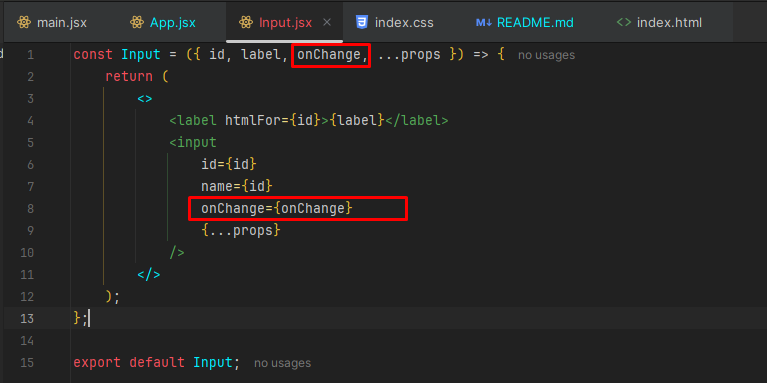
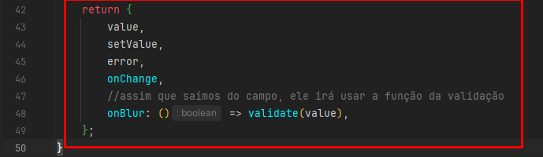

# About

Estudo sobre formulários do curso de React da Origamid.

# Input

Vamos abordar como criar um campo de formulário reativo.

## Reatividade

Precisamos definir o estado para o ``value`` (usando hook) e a função atualizadora (set que vem do hook) para o ``onChange``.

O valor que está sendo alterado fica dentro de event, então acessamos o target com seu valor.

```jsx
const App = () => {
    const [nome, setNome] = useState('');
    
    return (
        <form>
            <label htmlFor="nome">Nome</label>
            <input
                type="text"
                id="nome" //usa o mesmo que está no htmlFor
                value={nome}
                onChange={(event) => setNome(event.target.value)}
            />
            <p>{nome}</p>
        </form>
    )
}
```

## Form

No form controlamos o que acontece ao enviar o mesmo, por isso definimos uma função para lidar com o ``onSubmit``.

O ``preventDefault()`` irá prevenir o comportamento padrão, que seria de atualizar a página, enviando uma requisição
para o que estiver em ``action=""``.

Então não precisa colocar o evento de onSubmit no botão! Se o botão está dentro de form, o submit já será feito.

```jsx
const App = () => {
    const [nome, setNome] = useState('');
    
    function handleSubmit(event) {
        event.preventDefault(); //evita refresh da tela
        console.log(nome)
    }
    
    return (
        <form onSubmit={handleSubmit}>
            <label htmlFor="nome">Nome</label>
            <input
                type="text"
                id="nome" //usa o mesmo que está no htmlFor
                value={nome}
                onChange={(event) => setNome(event.target.value)}
            />
            <button>Enviar</button>
        </form>
    )
}
```

## Múltiplos Campos

Às vezes, vamos lidar com múltiplos campos no form, um para email, outro para nome, etc. Existe duas maneiras de lidar
com isso:

1. Podemos definir um estado (useState) para cada campo (nome, email, etc).

```jsx
const App = () => {
  const [nome, setNome] = React.useState('');
  const [email, setEmail] = React.useState('');

  function handleSubmit(event) {
    event.preventDefault();
    console.log(nome, email);
  }

  return (
    <form onSubmit={handleSubmit}>
      <label htmlFor="nome">Nome</label>
      <input
        type="text"
        id="nome"
        value={nome}
        onChange={(event) => setNome(event.target.value)}
      />
        
      <label htmlFor="email">Email</label>
      <input
        type="email"
        id="email"
        value={email}
        onChange={(event) => setEmail(event.target.value)}
      />
      <button>Enviar</button>
    </form>
  );
};
```
<hr>

2. Podemos definir um objeto que irá conter todos os valores dos campos do formulário:

Note que agora, a função handleChange fica diferente. A gente passa o ``target`` desestruturado.

Desestruturamos também o target, pegando o id e value do input que está sendo alterado.

Por fim, pegamos o setForm para definir! Só que não podemos passar o valor puro, visto que agora ele é um objeto.

Então passamos o que já existe com spread, o id em [] e seu valor.

Entenda, quando falamos ``[id]: value`` é igual a ``nome: 'teste'``, por exemplo.

```jsx
const App = () => {
  const [form, setForm] = React.useState({
    nome: '',
    email: '',
  });

  function handleSubmit(event) {
    event.preventDefault();
    console.log(form);
  }

  function handleChange({ target }) {
    const { id, value } = target;
    setForm({ ...form, [id]: value });
  }

  return (
    <form onSubmit={handleSubmit}>
      <label htmlFor="nome">Nome</label>
      <input type="text" id="nome" value={form.nome} onChange={handleChange} />
      <label htmlFor="email">Email</label>
      <input
        type="email"
        id="email"
        value={form.email}
        onChange={handleChange}
      />
      <button>Enviar</button>
    </form>
  );
};
```

# Textarea

No React o ``textarea`` é utilizado como se fosse um input, uma tag única sem abertura/fechamento e com o value para definir
o seu valor interno.

Note como desestruturamos o target direto passando como parâmetro no callback, settando a mensagem com a função do useState.

```jsx
import {useState} from "react";

const App = () => {
    const [mensagem, setMensagem] = useState('');
    
    return (
        <form>
            <textarea
                id="mensagem"
                value={mensagem}
                rows="5"
                onChange={({target}) => setMensagem(target.value)}
            />
            <p>{mensagem}</p>
        </form>
    )
}
```

# Select

O ``value`` e ``onChange`` são definidos no select. Para definir um valor inicial, coloque o mesmo no useState.

```jsx
import {useState} from "react";

const App = () => {
    const [select, setSelect] = useState("");
    //const [select, setSelect] = useState("smartphone");//caso queira deixar algo aparecendo logo de cara
    return (
        <form>
            <select value={select} onChange={({target}) => setSelect(target.value)}>
                <option disabled value=""></option> //forca o User a selecionar algo, irá aparecer um campo vazio
                <option value="notebook">Notebook</option>
                <option value="smartphone">Smartphone</option>
                <option value="tablet">Tablet</option>
            </select>
            <p>{select}</p>
        </form>
    );
};
```

Caso a gente queira "forçar" o usuário a selecionar algo, adicionar uma option vazia com disabled, ficará assim:


Ou, podemos passar um valor no useState para já ficar algo selecionado.

# Radio

No ``radio``, comparamos o valor selecionado com o valor do input, dentro do atributo checked. O que retornar true, irá
marcar o botão.

Ou seja, o que está dentro de ``value`` não importa muito, pois é estático! O que conta (é reativo) é o que checamos dentro do ``checked``.

```jsx
import {useState} from "react";

const App = () => {
    const [radio, setRadio] = useState('');
    
    function handleChange({target}) {
        setRadio(target.value);
    }
    
    return (
        <form>
            <label>
                <input
                    type="radio"
                    value="notebook"
                    checked={radio === 'notebook'} //retorna true ou false
                    onChange={handleChange}
                />
                Notebook
            </label>

            <label>
                <input
                    type="radio"
                    value="smartphone"
                    checked={radio === 'smartphone'} //retorna true ou false
                    onChange={handleChange}
                />
                Smartphone
            </label>
        </form>
    )
}
```

# Checkbox

Também é um tipo de input. O estado do checkbox está relacionado ao ``checked``, então queremos verificar se ele está
marcado ou não.

Como o valor de checked é valor estático, iniciamos ele como false para modificá-lo depois.

Portanto, dentro do handleChange, acessamos o target desestruturado. Como ele é um input do tipo checkbox, ele possui
a propriedade de checked que retorna um boolean. Como marcamos ele, será true.

```jsx
import {useState} from "react";

const App = () => {
    const [checkbox, setCheckbox] = useState(false);
    
    function handleChange({target}) {
        setCheckbox(target.checked);
    }
    
    return (
        <form>
            <label>
                <input
                    type="checkbox"
                    value="termos"
                    checked={checkbox}
                    onChange={handleChange}
                />
                Aceito os termos.
            </label>
        </form>
    )
}
```

# Checkbox - Múltiplos Itens

Imagine uma página que mostra para o usuário qual a preferência de notícias para ele, exemplo: esportes, finanças, política,
etc. Serão vários itens que serão selecionados.

Podemos definir um estado para cada item ou uma array que irá conter todos os itens selecionados.

```jsx
function App() {
    const [cores, setCores] = useState([]); //criamos Array pura e vazia

    function handleChecked(cor) {
        return cores.includes(cor); //retorna true ou false
    }

    //target desestruturado
    function handleCheckboxChange({target}) {
        //se o checkbox estiver marcado, pega a lista que ja existe e o coloca
        //o que foi selecionado
        if (target.checked) {
            setCores([...cores, target.value]);
        }
        //se não foi checked, faz um filtro para retornar uma array sem o
        //elemento q n foi marcado (ou desmarcado)
        else {
            setCores(cores.filter((cor) => cor !== target.value));
        }

    }

    return (
        <>
            <form>
                <label>
                    <input
                        type="checkbox"
                        value="azul"
                        checked={handleChecked('azul')} //método para verificar se a cor existe na array
                        onChange={handleCheckboxChange}
                    />
                    Azul
                </label>

                <label>
                    <input
                        type="checkbox"
                        value="verde"
                        checked={handleChecked('verde')}
                        onChange={handleCheckboxChange}
                    />
                    Verde
                </label>

                <label>
                    <input
                        type="checkbox"
                        value="vermelho"
                        checked={handleChecked('vermelho')}
                        onChange={handleCheckboxChange}
                    />
                    Vermelho
                </label>
            </form>
            <div>
                <h2>Cores Selecionadas</h2>
                <ul>
                    {cores.map((cor) => (
                        <li key={cor}>{cor}</li>
                    ))}
                </ul>
            </div>
        </>

    )
}
```

## Evitando repetir código

Para evitar escrever uma label toda hora, poderíamos, por exemplo, ter uma array pré-definida com as cores e fazer o seguinte:


# Transformando Tudo em Componente - Simplificando

Como tudo que fizemos é reutilizável, podemos definir um componente para cada tipo de campo do formulário, assim
evitando criar código repetido.

## Componente Input

Input aqui seria tudo que se parece com input text: name, password, email...

Elementos ``input`` que não são text (radio/checkbox), seriam separados em outro componente.

Sua construção, já sabemos! No exemplo abaixo, fizemos a desestruturação das suas propriedades (que serão inseridas
ao criar o componente no ``App.jsx``).

Passamos até mesmo o setValue e o ``...props`` para eventuais propriedades que forem adicionadas (tipo required).

```jsx
// /form/input.jsx
const Input = ({id, label, setValue, ...props}) => {
    
    return (
        <>
            <label htmlFor={id}>{label}</label>
            <input
                id={id} 
                name={id}
                onChange={({target}) => setValue(target.value)}
                //eventuais propriedades que podem ser add
                {...props}
            />
        </>
    )
}
```

Note como criamos o mesmo no ``App.jsx``. Passamos o id, label. No tocante ao setValue, nós criamos um state para ser
alterado!

Se tivéssemos outros inputs, poderíamos criar outros estados ou um com objeto como fizemos lá em cima.

```jsx
import {useState} from "react";

const App = () => {

    const [nome, setNome] = useState('');

    return (
        <form>
            <Input 
                label="Nome"
                id="nome"
                type="text"
                value={nome}
                setValue={setNome}
            />
        </form>
    )
}
```

## Componente Select

Mesma coisa! Criamos um componente à parte, fazemos a desestruturação e importamos no ``App.jsx``.

Entretanto, sabemos que o select lida com opções, portanto na desestruturação, precisamos ter um Array de opções.

De resto, o de sempre, o valor e setValue para o estado que eventualmente vai ser criado, e eventuais props com ``...props``.

Também criamos um option primeiro vazio e desabilitado (forçando o usuário a selecionar algo) e aí sim criamos outro
mapeando, criando um option para cada elemento da array.

```jsx
//select.jsx

const Select = ({options, value, setValue, ...props}) => {
    return (
        <select
            value={value}
            onChange={({target}) => setValue(target.value)}
            {...props}
        >
            <option value="" disabled>
                Selecione
            </option>
            {options.map((option) => (
                <option key={option} value={option}>
                    {option}
                </option>
            ))}
        </select>
    )
}
```

```jsx
//app.jsx
import {useState} from "react";

const App = () => {
    const [produto, setProduto] = useState('');
    
    return (
        <>
            <form>
                <Select
                    options={['Notebook', 'Smartphone', 'Tablet']}
                    value={produto}
                    setValue={setProduto()}
                />
            </form>
        </>
    )
}
```

## Componente Radio

Repare na checagem para verificar o reativo, vendo se a option marcada é igual ao valor que foi declarada como valor no ``App.jsx``.

```jsx
//Radio.jsx
const Radio = ({options, value, setValue, ...props}) => {
    return (
        <>
            {options.map((option) => (
                <label key={option}>
                    <input
                        type="radio"
                        value={option}
                        checked={value === option}
                        onChange={({target}) => setValue(target.value)}
                        {...props}
                    />
                    {option}
                </label>
            ))}
        </>
    )
}
```

```jsx
//App.jsx

import {useState} from "react";

const App = () => {
    const [cor, setCor] = useState('');
    
    return (
        <form>
            <Radio
                options={['azul', 'verde', 'amarelo']}
                value={cor}
                setvalue={setCor}
            />
        </form>
    )
}
```

## Componente Checkbox

Repare como fazemos o checked direto ali dentro, verificando se ele inclui a opção.

E no onChange, usamos a função de antes para adicionar ou remover elemento a lista.

```jsx
// Checkbox.jsx
const Checkbox = ({options, value, setValue, ...props}) => {
    
    function handleChange({target}) {
        if (target.checked) {
            setValue([...value, target.value]);
        } else {
            setValue(value.filter((cor) => cor !== target.value));
        }
    }
    
    return (
        <>
            {options.map((option) => (
                <label key={option}>
                    <input 
                        type="checkbox"
                        value={option}
                        checked={value.includes(option)}
                        onChange={handleChange}
                    />
                    {option}
                </label>
            ))}
        </>
    )
}
```

```jsx
// App.jsx
import {useState} from "react";

const App = () => {
    const [fruta, setFruta] = useState([]);
    const [termos, setTermos] = useState([]);
    
    return (
        <form>
            <Checkbox
                options={['Uva', 'Laranja', 'Limão']}
                value={fruta}
                setValue={setFruta}
            />

            <Checkbox
                options={['Termos e Condições']}
                value={termos}
                setValue={setTermos}
            />
        </form>
    )
}
```

# Validação

Vamos primeiro falando do ``onBlur``.

O ``onBlur`` é ativado sempre que o campo fica fora de foco (saímos do elemento), momento perfeito para validarmos o dado do campo.

A validação pode ser com JavaScript utilizando REGEX.

REGEX seria o que está dentro do else-if. Verificamos se possui cinco dígitos, se tem hífen e se termina com 3 dígitos.

Outra coisa interessante, é que mudamos a estruturação do componente Input. Anteriormente, no onChange, utilizávamos a
função de set do useState, e dentro do componente, fazíamos a verificação com a função de callback, assim:

**No componente input:**


<hr>

**No App.jsx:**


<hr>

Agora, ao ocorrer uma mudança, simplesmente usamos a função de handleChange! E dentro do componente, não usamos mais
a função de set do useState, e sim o ``onChange``. Isso evita que ao usuário sair do campo de CEP, ele já emita uma 
mensagem de erro. Ficará assim:

**No componente Input:**

Passamos o onChange como parâmetro.



<hr>

No App.jsx:

Usamos a função de handleChange


<hr>

Outra coisa interessante é validar também ao enviar o formulário. Devemos impedir o envio do formulário caso exista erro no preenchimento.

Agora ele valida em três momentos: ao sair do componente (onBlur), valida caso tenha algum erro (em toda mudança que tiver) e 
valida também ao enviar o formulário.


```jsx
const App = () => {
    const [cep, setCep] = useState('');
    const [error, setError] = useState(null);
    
    function handleSubmit(event) {
        event.preventDefault();
        //se o cep for valido, irá enviar
        if (validateCep(cep)) {
            console.log('Enviar');
        } else {
            console.log('Não enviar');
        }
    }
    
    function validateCep(value) {
        if (value.length === 0) {
            setError('Preencha um valor');
            return false;
        } else if (!/^\d{5}-?\d{3}$/.test(value)) {
            setError('Preencha um cep válido');
            return false;
        } else {
            setError(null);
            return true;
        }
    }
    
    function handleBlur({target}) {
        validateCep(target.value);
    }
    
    function handleChange({target}) {
        //sem isso, assim que o user começar a digitar
        //vai aparecer mensagem de erro
        if (error) validateCep(target.value); 
        setCep(target.value)
    }
    
    return (
        <form onSubmit={handleSubmit}>
            <Input 
                label="CEP"
                id="CEP"
                type="text"
                value={cep}
                onChange={handleChange}
                onBlur={handleBlur}
            />
            {error && <p>{error}</p>}
            <button>Enviar</button>
        </form>
    );
};
```

# Custom Hook useForm

Tudo isso que aprendemos acima foi bem interessante. Mas podemos também criar um custom hook para formulários, onde
será possivel fazer várias validações.

Poderemos passar uma lista de validações, onde teremos sempre o REGEX que iremos valiar e a mensagem a ser exibida.

Vamos começar pelo hook.

## useForm

A primeira coisa que queremos é settar seu estado (estado do formulário), então é a primeira coisa que iremos criar.


Agora vem a parte de criar a função de validação. Anteriormente, a gente checava o regex só do CEP! Como agora terão
outros campos, faremos algumas alterações.

Quando o usuário for utilizar esse hook, ele irá precisar passar um argumento, um type (se é name, password, email...).

Criaremos esse type fora do escopo. Será uma lista de objetos com vários tipos diferentes.


<hr>

Agora, dentro da função, poderemos usar esse objeto para realizar a verificação.


<hr>

Como todo hook, iremos definir o nosso retorno (objeto com as variáveis):


<hr>

Faremos algumas alterações agora no App.jsx e no componente de Input.

Usaremos o hook dessa maneira, sem a necessidade de passar uma função de set, uma vez que ela já irá existir dentro do
hook. A ideia é somente passar a string do type a ser utilizado.


Ao chamar o componente de Input, poderíamos até passar o cep como um props ``...cep``, mas isso iria expor todos os
objetos que retornamos no custom hook:



<hr>

Então, qual seria a ideia? Iremos alterar o componente de Input, ele não terá mais um ``...props`` desestruturado, ao
invés disso, iremos desestruturar cada propriedade que iremos utilizar, veja:

Tudo desestruturado e sendo utilizado dentro do componente, juntamente com o erro para caso exista, seja exibido em um
parágrafo.


<hr>

Agora no ``App.jsx``, passamos as propriedades com o ``...cep``. Sim, utilizamos ele dessa forma, para que ele traga:
onBlur, onChange e demais objetos que são retornados dele!


## Compreendendo tudo que foi feito

